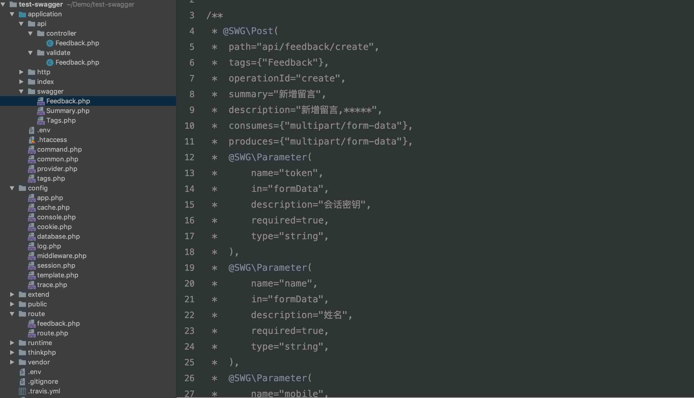
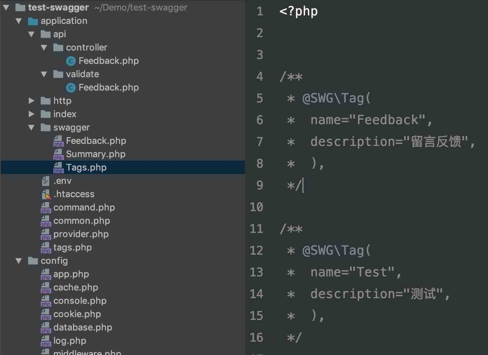

<h1 align="center"> think-swagger </h1>

<p align="center"> 专门为 Thinkphp5 生成 swagger 注释文档.</p>

## 项目简介
为了能够方便的测试 api 接口，我们一般会选择书写 swagger 注释来生成相关文档，但书写注释是一个大量重复且没有啥技术含量的体力劳动，且还会容易出错。

该扩展包可以通过访问 api 接口时自动生成相应的 swagger 注释，告别手动书写注释。

目前生成的 swagger 注释支持 swagger-php ~2.0


## 安装

```shell
$ composer require tien/think-swagger
```

## 使用
### 生成方法体的 swagger 注释
#### 前提：
1. 以某个项目的 feedback 模块为例。
2. 该模块下有 create, index, show, update 及 delete 五个 action。
3. 该模块的访问地址是 http://domain.com/api/feedback/*****。
4. 最佳使用体验是通过中间件，下面示例也是通过中间件完成的，若 TP 版本低于 5.1.6，请自行参考代码实现，谢谢！

#### 在 feedback 模块的验证类代码如下：
	
	use Tien\ThinkSwagger\Core; 	//需要引入 Core 类
	
	class Feedback extends Validate
	{
		use Core;		//需要引入 Core 类
		
		protected $rule = [
			'name|姓名' => 'require|max:32',
			'mobile|手机号' => 'require|mobile',
			'headImg|头像' => 'require|image',
			'resume|简历' => 'require|file',
			'token|会话密钥' => 'require|length:32',
			'id|反馈 id' => 'require|integer|gt:0' 
		];
		
		
		protected $scene = [
		 	'create' => ['token', 'name', 'mobile', 'headImg', 'resume'],
		];
		
		
		/**
		 * 需要增加一个数组，用来解释接口的作用
		 * 注意是 public 修饰
		 */
		public $tienText = [
			'create' => '新增留言,*****'
		];
	
	}
#### 中间件代码如下：
	
	public function handle($request, \Closure $next)
	{
		//存放生成 swagger 注释的文件路径
		$path = \think\facade\Env::get('app_path') . 'swagger/';
		
		//实例化对象
		$tien = new \Tien\ThinkSwagger\Method($path);
		
		/**
		 * 建议书写如下判断
		 * 若不是开发环境，直接结束该中间件
		 * 若在 .env 文件中配置了 APP_DEBUG 属性，那么判断如下。
		 * 如果没有配置，强烈建议自行判断
		 */
		if (!$tien->verifyIsDev()) {
			return $next($request);
		}
		
		/**
		 * 初始化信息
		 * 方法 setIgnoreRoute 忽略路由的前缀字符，不是必须的，可自行尝试
		 */
		$tien = $tien->setIgnoreRoute('api/')->initRequest($request);
	
		//需判断该注释体是否已存在，避免重复生成
		if (!$tien) {
			return $next($request);
		}
		
		//生成注释
		$tien->formatContent()->create();
	
		return $next($request);
	
	}
#### 生成注释
把该中间件注册到 feedback 模块中，建议添加到模块下的 middleware.php 文件。

再 POST 调用 create 接口的地址 http://****/api/feedback/create。

会在 application/swagger 目录下生成 Feedback.php 文件（若没有更改生成路径的话）。具体效果查看附录一。

#### 自动替换
若我们继续完成 feedback 模块的 update 方法，当完成 scene.update 时，会发现很多验证规则已不再是 require 的了，比如 name, headImg 等字段不是必填的，而可能只有 id 及 token 是必填的，那么我们可以如下书写：
	
	//Feedback 验证类中，还是引入了 \Tien\TienSwagger\Core 类。
	protected $tienSupplySuffix = '_no';	//默认是 ‘_no’,可以更改
	
	
	
	pretected $scene = [
		'create' => [……],
		'update' => ['token', 'id', 'name_no', 'mobile_no', 'headImg_no', 'resume_no'],		// 有 ‘_no’ 后缀的表示不是必填的
	];
	
	public $tienText = [
		'create' => '新增留言,*****',
		‘update’ => '更新留言，只能本人操作',
	];

再 PUT 调用接口地址 http://***/api/feedback/update/1。

会在 application/swagger 目录下的 Feedback.php 文件中生成注释（若没有更改生成路径的话）。具体效果查看附录一。

#### 获取添加后缀的验证规则

	$validate = new \app\api\validate\Feedback();
	
	$updateRule = $validate->getRuleByAction('update');
	
	var_dump($updateRule); // 有 '_no' 后缀的，会替换掉 require 字符

### 生成 api 文档的简介
执行如下代码：
	
	// swagger 文件路径
	$path = \think\facade\Env::get('app_path') . 'swagger/';
	
	//实例化对象
	$summary = new \Tien\ThinkSwagger\Summary($path);
	
	//生成注释
	echo $summary->setFilename('Summary.php')
		->setSchemes(['http', 'https'])
		->setHost('127.0.0.1:8000')
		->setConsumes('multipart/form-data')
		->setProduces('application/json')
		->setVersion('V0.1')
		->setTitle('接口文档')
		->setDescription('Hello world think-swagger, 一个专门为 TP5 生成 swagger 注释的扩展包，可以更加具有对象特性')
		->formatContent()
		->create();

效果图查看附录一。

### 生成 api 模块的简介
执行如下代码：
	
	// swagger 文件路径
	$path = \think\facade\Env::get('app_path') . 'swagger/';
	
	//实例化对象
	$tag = new \Tien\ThinkSwagger\Tags($path);
	
	$tagArr = [
		'Feedback' => '留言反馈',
		'Test' => '测试', 
	];
	
	//生成注释
	echo $tag->setFilename() //默认 Tags.php
		->setTags($tagArr)
		->formatContent()
		->create();

效果图查看附录一。
	
#### 额外提示
当生成 swagger 注释文档之后，应该通过 swagger-php 生成相应的 json 文件。在项目根目录下执行如下命令(详情 [swagger-php](https://github.com/zircote/swagger-php))：

```shell
$ php ./vendor/zircote/swagger-php/bin/swagger ./application/ -o public/swagger.json
```

再通过 swagger-ui 解析生成的 swagger.json 文件（详情 [swagger-ui](https://github.com/swagger-api/swagger-ui)）。

## Contributing

You can contribute in one of three ways:

1. File bug reports using the [issue tracker](https://github.com/tienZheng/think-swagger/issues).
2. Answer questions or fix bugs on the [issue tracker](https://github.com/tienZheng/think-swagger/issues).
3. Contribute new features or update the wiki.
4. 相关问题也可以在 [TP 论坛](http://www.thinkphp.cn/topic/index/sort/1.html) 中讨论。

_The code contribution process is not very formal. You just need to make sure that you follow the PSR-0, PSR-1, and PSR-2 coding guidelines. Any new code contributions must be accompanied by unit tests where applicable._

## 附录一
swagger 注释文件 Feedback.php



swagger 注释文件 Summary.php


swagger 注释文件 Tags.php



网页效果图一 


网页效果图二


网页效果图三


## License

MIT